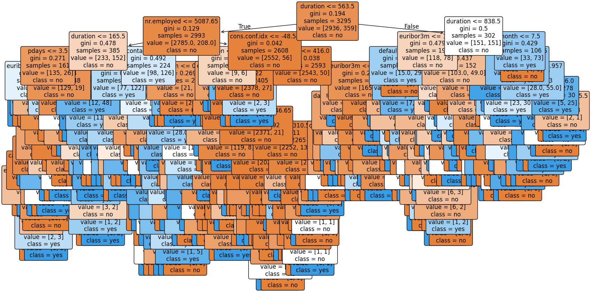

# Decision Tree Classifier for Customer Purchase Prediction

## Introduction

This project involves building a Decision Tree Classifier to predict whether a customer will purchase a product or service based on their demographic and behavioral data. The dataset used is related to direct marketing campaigns of a Portuguese banking institution.

## Dataset

The dataset consists of 4,119 entries and 21 columns. The columns include demographic information, details of previous marketing campaigns, and economic indicators. The target variable, `y`, indicates whether the customer subscribed to a product ("yes" or "no").

### Columns:

- `age`: The age of the customer (integer).
- `job`: The type of job the customer has (categorical).
- `marital`: Marital status (categorical).
- `education`: Education level (categorical).
- `default`: Whether the customer has credit in default (categorical).
- `housing`: Whether the customer has a housing loan (categorical).
- `loan`: Whether the customer has a personal loan (categorical).
- `contact`: The type of contact communication (categorical).
- `month`: Last contact month of the year (categorical).
- `day_of_week`: Last contact day of the week (categorical).
- `duration`: The last contact duration, in seconds (integer).
- `campaign`: Number of contacts performed during this campaign (integer).
- `pdays`: Number of days since the client was last contacted (integer).
- `previous`: Number of contacts performed before this campaign (integer).
- `poutcome`: Outcome of the previous marketing campaign (categorical).
- `emp.var.rate`: Employment variation rate (float).
- `cons.price.idx`: Consumer price index (float).
- `cons.conf.idx`: Consumer confidence index (float).
- `euribor3m`: Euribor 3 month rate (float).
- `nr.employed`: Number of employees (float).
- `y`: The target variable, indicating whether the customer subscribed to a product ("yes" or "no").

## Preprocessing

The following preprocessing steps were performed:

1. **Encoding Categorical Variables**: 
   - All categorical variables were encoded using `LabelEncoder`.
   - The target variable `y` was also encoded, with "yes" mapped to 1 and "no" mapped to 0.

2. **Splitting Data**:
   - The dataset was split into features (X) and target (y).
   - The data was further split into training and test sets with a ratio of 70:30.

## Model Building

A Decision Tree Classifier was built using the `sklearn` library. The classifier was trained on the training set and evaluated on the test set.

```python
from sklearn.tree import DecisionTreeClassifier

# Building the Decision Tree Classifier
classifier = DecisionTreeClassifier(random_state=42)
classifier.fit(X_train, y_train)

# Making predictions
y_pred = classifier.predict(X_test)
```

## Evaluation

The model's performance was evaluated using accuracy, precision, recall, and F1-score.

- **Accuracy**: 88.75%
- **Precision**: 
  - Class 0 (No Purchase): 0.95
  - Class 1 (Purchase): 0.47
- **Recall**:
  - Class 0: 0.93
  - Class 1: 0.55
- **F1-Score**:
  - Class 0: 0.94
  - Class 1: 0.51

## Inference

The Decision Tree Classifier performs well in predicting non-purchasers (Class 0) with a high precision and recall. However, the performance is less effective for predicting purchasers (Class 1), as indicated by the lower precision, recall, and F1-score. This imbalance is a common issue in datasets where one class significantly outweighs the other.

### Detailed Analysis:

- **Class Imbalance**: The dataset is imbalanced, which affects the model's ability to correctly identify the minority class (purchasers). Techniques like resampling or using different metrics such as the area under the precision-recall curve (AUC-PR) might provide better insight into model performance.

- **Model Tuning**: Hyperparameter tuning of the Decision Tree could improve the model's performance. Techniques such as Grid Search or Random Search can be employed to find the optimal parameters.

- **Alternative Models**: While Decision Trees are easy to interpret, they might not always be the best choice for this type of problem. Exploring other models such as Random Forests, Gradient Boosting, or Support Vector Machines could provide better results.

### Graphical Representation:

Insert graphs here to show the decision tree structure, feature importance, or ROC curves.




## Conclusion

The Decision Tree Classifier provides a good starting point for predicting customer purchases, particularly in identifying non-purchasers. However, the model's ability to predict actual purchasers is limited, indicating the need for further tuning or alternative modeling approaches. Future work could involve addressing class imbalance and exploring other classification models.

